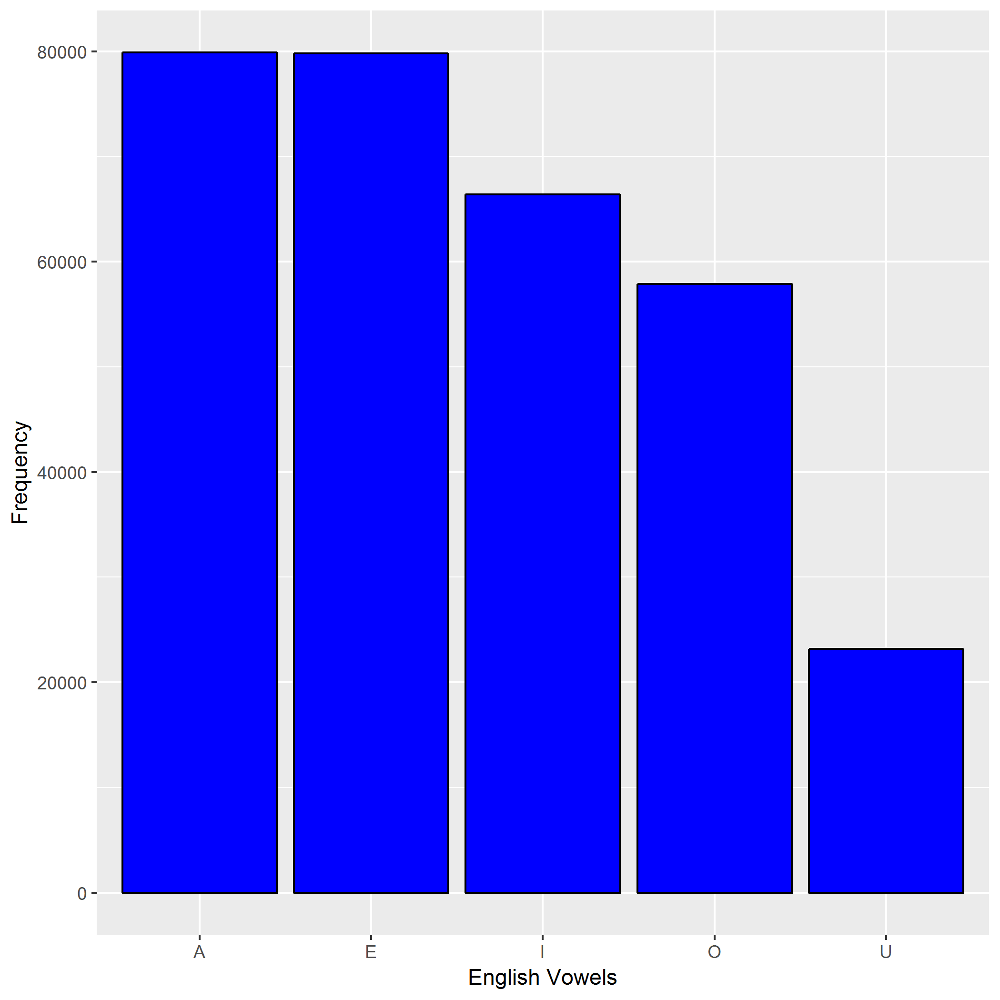

```{r load-hist-dat, include = FALSE}
vow <- read.delim("vowels_count.tsv")
```


I converted all the words in `words.txt` to lowercase characters and then computed the frequency, that is, the count of each vowels `(a, e, i, o, u)` in `words.txt`.
We can see that vowel `U` appears the least number of times, that is, `87389` times and vowel `E` appears the maximum  that is `235408`


Here is a histogram.

   
